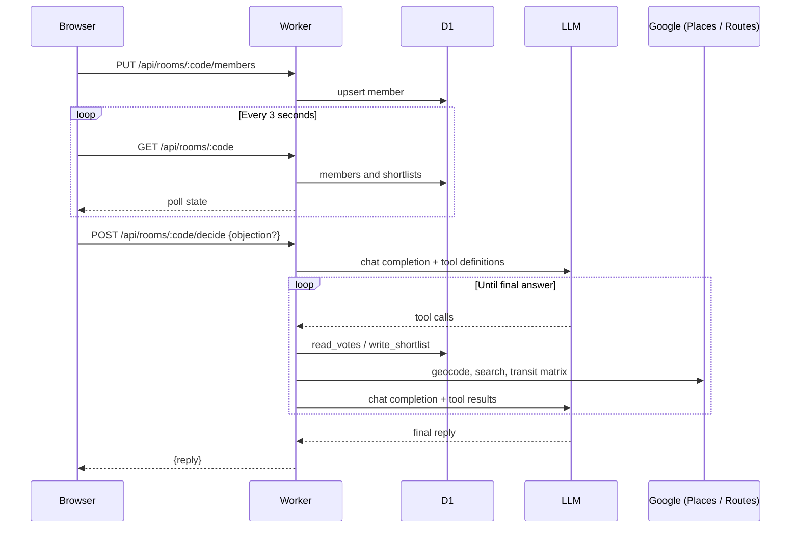

# Da Jia Chi (大家吃)

Da Jia Chi helps a group pick where to eat. Everyone joins a poll, says where they are coming from, what they feel like and what they can't eat, and a referee (an LLM with tools) suggests up to three places near a fair meeting point, ranked so that nobody's trip is much longer than the rest. The referee speaks casual Singaporean English and says who lost out and why.

The page design follows the "Da Jia Chi" landing-page mock-up: a round table of seat cards around a "Shortlist" disc, with each person's travel time on every result and the longest trip highlighted.

## Architecture

It runs as a single Cloudflare Worker with a D1 database. `src/index.js` routes requests and serves the page from `src/ui.html`. The browser polls the poll (called a "room" in the code and API) every 3 seconds, so everyone sees new answers and shortlists without any push infrastructure.

`POST /api/rooms/:code/decide` hands the turn to the agentic loop in `src/loop.js`. The loop calls an OpenAI-compatible chat completions endpoint with the tool definitions from `src/tools.js`. When the model asks for a tool call, the loop runs it, appends the result, and calls the model again until it gives a final answer. `src/prompt.js` sets the referee's persona and rules, `src/travel.js` holds the geometry, travel-time and ranking maths, `src/db.js` holds all D1 access and `src/validate.js` checks member input.

| Tool | What it does |
|---|---|
| `read_votes` | Reads members, cuisine likes, a vote tally, a dietary summary with clash warnings, and recent shortlists from D1. |
| `locate_members` | Geocodes each member's typed area with Places Text Search, then returns the midpoint and how spread out the group is. |
| `find_candidates` | Searches Places around the midpoint (radius scaled to the spread, 1.5 to 5 km), fetches every person's transit time from the Routes API, and returns places ranked fairest first. |
| `get_rain_forecast` | Two-hour forecast for a Singapore area from data.gov.sg (no key needed). |
| `write_shortlist` | Saves one to three places with a reason each. Only accepts ids that `find_candidates` returned this run. |

## Request flow



## Rules the referee follows

- The six dietary options (halal, vegetarian, vegan, no beef, no shellfish, nut allergy) are hard rules. They are checkboxes, so the model cannot misread them, and it never drops one to fit a cuisine.
- Cuisine likes are soft. The most-voted cuisine wins; if nothing fits, the referee relaxes likes and says so. If the dietary rules alone leave fewer than three places, it shows fewer and says so, and never pads the list.
- Google can only tell us whether a place serves vegetarian food. Halal, vegan, no beef, no shellfish and nut allergy are always flagged "Confirm with the restaurant", and the referee never claims a place is halal-certified or safe for an allergy.
- Places are ranked by the shortest longest trip, then by total travel time. The model may reorder with a stated reason. Names, times and flags always come from the search results, never from the model.
- A trip over 60 minutes is flagged, and the referee suggests meeting at a central MRT hub.
- Anyone in the poll can ask for a new shortlist and add an objection. Each run is one new row, so earlier shortlists stay visible. A run takes a minute or two, and the 10-second spacing between runs is checked against the last stored shortlist, so two people pressing the button during the same run will both start one.

## Travel times

Times are minutes by public transport, leaving now, from the Google Routes API `computeRouteMatrix` with `TRANSIT`. One request covers everyone to every candidate, and Google allows 100 pairs per transit request, so the number of candidates is 100 divided by the number of people.

If the Routes API is not enabled, or Google has no route for a pair, that pair uses a straight-line estimate (distance × 1.3 at 22 km/h plus 5 minutes). Estimated times are shown with a "~". Everything keeps working without Routes enabled, but every time will be an estimate.

## Limits

- Polls hold at most 10 members. Rejoining with the same name (any case) edits that member.
- The code is the only access control. Anyone with it can edit any member and see everyone's name, area, diet and cuisines.
- Polls older than 24 hours are deleted, with their members and shortlists, whenever a new poll is created.
- The member cap check is not atomic, so two simultaneous joins could overshoot it by one.
- `servesVegetarianFood` is a Places Atmosphere field and the Routes transit matrix is billed per pair, so each shortlist costs more than a plain search.

## Setup

1. Install dependencies:
   ```sh
   npm install
   ```
2. Create `.dev.vars` from `.env.example` and fill in your keys:
   ```sh
   cp .env.example .dev.vars
   ```
   - `OPENCODE_API_KEY`: key for the OpenAI-compatible endpoint.
   - `GOOGLE_PLACES_API_KEY`: a Google Maps Platform key with **Places API (New)** and **Routes API** enabled. Without Routes, travel times are estimates.
3. Create the tables locally (this works with the placeholder `database_id`):
   ```sh
   npm run db:local
   ```
4. Run it locally:
   ```sh
   npm run dev
   ```

To use a real Cloudflare database, create it with `npx wrangler d1 create food-finder`, paste the `database_id` into `wrangler.toml`, then run `npm run db:remote`.

## Deploy

```sh
npx wrangler secret put OPENCODE_API_KEY
npx wrangler secret put GOOGLE_PLACES_API_KEY
npm run deploy
```

## Tests

```sh
npm test
```

Tests cover the travel maths and ranking, the dietary check, input validation, shortlist validation, the agentic loop and the routes. D1 is replaced by an in-memory fake in `test-support/fake-d1.mjs`, and Google, the forecast and the LLM by `test-support/world.mjs`. The transit path is tested against the documented Routes response shape, not against live Singapore data.
